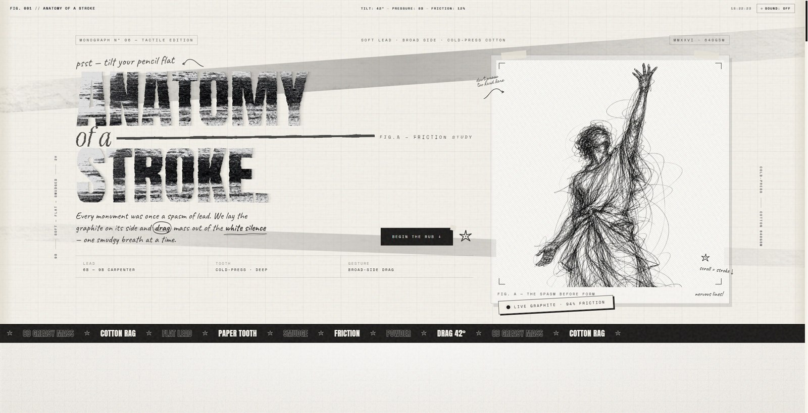
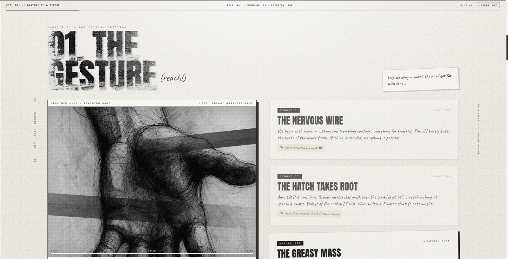
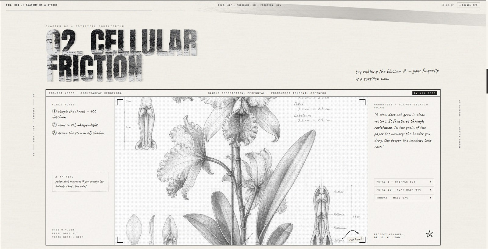
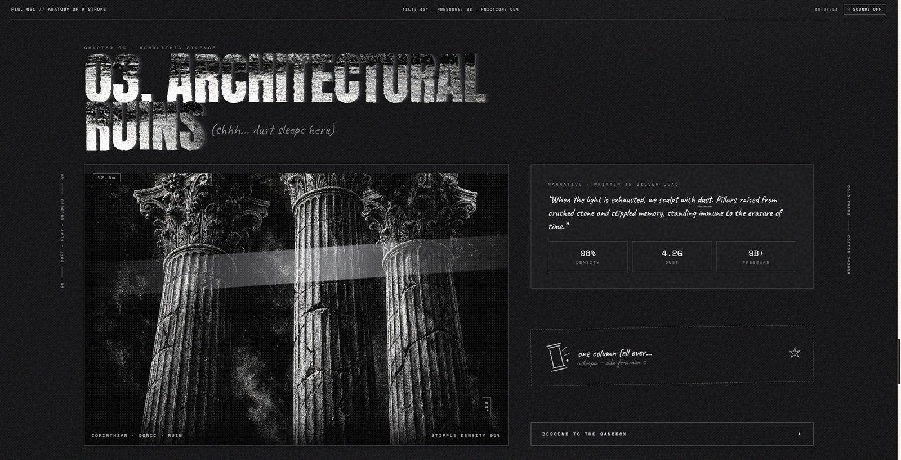
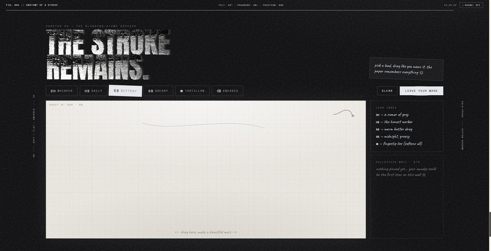

# Monumental: Anatomy of a Stroke

A tactile digital monograph investigating the physical mechanics of graphite on cold-press cotton. Built on the premise that digital interaction can transcend sterile vectors to embody mass, grain, friction, and resistance.

**Live Exhibition**: [https://monumental-three.vercel.app](https://monumental-three.vercel.app)

---

## The Curatorial Thesis

> *"Every monument was once a spasm of lead. We lay the graphite on its side and drag mass out of the white silence — one smudgy breath at a time."*

In an era dominated by polished, mathematically sterile user interfaces, *Anatomy of a Stroke* restores the visceral physical friction of traditional drawing. Scrolling is not navigation; it is a broad stroke that deposits tone across the tooth of cold-press cotton rag. As velocity and pressure modulate, wireframes fracture, midtones settle into the paper valleys, and dense, oily shadows take root.

---

## Visual Plates & Exhibition Chapters

### Plate I: The Friction Study (Hero Section)

The monograph opens with Monograph No. 06. A carpenter lead laid flat across the surface initiates the primary drag study, framed by live drafting telemetry, marginalia annotations, and deckled paper boundary gradients.



*Key Mechanics:*
- Real-time kinematic tracking calculating tilt angle, lead pressure grade, and contact friction.
- Dynamic SVG displacement filtration replicating rough paper grain and edge tooth.
- Deckled margin gradients and drifting graphite smudge bands responsive to scroll inertia.

---

### Plate II: Chapter 01 — The Gesture

A kinetic study of form emergence through progressive tone deposition. As the user traverses the narrative, Specimen H-01 evolves through three distinct physical stages:

1. **Stage I: The Nervous Wire** — Trembling 2H contours probing the boundary of the figure.
2. **Stage II: The Hatch Takes Root** — Opposing 42-degree broad-side sweeps settling into the paper tooth.
3. **Stage III: The Greasy Mass** — Saturated 8B carbon deposit, transforming a trembling spasm into sculptural weight.



*Key Mechanics:*
- Sticky specimen observation panel synchronized with scroll depth.
- Multi-layered CSS image shading modulated dynamically through viewport calculations.
- Integrated telemetry stage gauge monitoring carbon saturation in real time.

---

### Plate III: Chapter 02 — Cellular Friction

An anatomical examination of botanical equilibrium (*Orchidaceae Xenoflora*). The specimen explores the concept of resistance in organic form, inviting the user to transform their cursor into a tortillon blending stump.



*Key Mechanics:*
- Radial cursor mask generating dynamic paper blurring and tone dispersion on hover.
- Kinematic audio triggers modulating tortillon scrape intensity based on cursor velocity.
- Comprehensive technical drafting frame featuring field notes, dimensional markers, and density metrics.

---

### Plate IV: Chapter 03 — Architectural Ruins (The Inversion)

Initiated by *The Great Smear*—a 340vh progressive scroll wipe—the monograph inverts from raw paper cotton into dark slate. Monolithic chalk columns emerge from velvet charcoal dust, exploring architectural permanence and decay.



*Key Mechanics:*
- Seamless theme state transition (`data-theme="dark"`) driven by scroll intersection.
- Chalk particulate simulation with randomized oscillation and lifecycle management.
- Dynamic inverted typography utilizing high-contrast graphite texture clippings.

---

### Plate V: Chapter 04 — The Blending-Stump Archive (Interactive Sandbox)

A tactile sandbox empowering the visitor to interact directly with the medium. Featuring six authentic drawing tools calibrated for specific grain and tooth responses, alongside a community exhibition wall.



*Key Mechanics:*
- High-frequency HTML5 Canvas rendering engine with double-buffered redraw preservation.
- Pressure-sensitive brush physics: velocity inversely scales width and opacity, mimicking physical pencil lead.
- Graphite speckle dispersion algorithm scattering stochastic particles along the stroke vector.
- Integrated canvas serialization allowing visitors to commit their marks to the collective wall.

---

## Architectural & Technical Innovations

### 1. Procedural Web Audio Synthesis Engine
Rather than relying on static audio recordings, the monograph features an autonomous procedural synthesis engine built entirely on the Web Audio API:
- **Continuous Paper Noise**: A multi-pole pink noise filter paired with Brownian integration to simulate organic cotton paper body without digital hiss.
- **Dynamic Contact Friction**: Modulates low-pass filter cutoffs (520Hz–1200Hz) and gain in direct proportion to scroll and cursor velocity.
- **Acoustic Impulses**: Synthesizes wood-core pencil clicks, kneaded rubber eraser contacts, and resonant infrasonic inversion tones.
- **Zero Asset Overhead**: Zero external audio files; 100% computed at runtime.

### 2. Resolution-Agnostic Fluid Proportions
To eliminate the spatial distortion commonly encountered on high-resolution displays:
- **Fluid Architectural Containment**: Bounded by `max-w-[min(92vw, 2200px)]`, allowing the layout to breathe naturally across compact 13-inch displays and expansive 32-inch 4K workstations.
- **Mathematical Typography Clamping**: Header and narrative type scales leverage CSS `clamp()` functions, preserving typographic hierarchy regardless of viewport dimensions.
- **Proportional Specimen Geometry**: Specimen viewports utilize dynamic viewport-relative heights, ensuring illustrations maintain their architectural presence.

### 3. Kinematic Drafting Cursor
- **Spring-Damper Interpolation**: Cursor follower utilizes spring inertia to simulate the weight of a physical blending stump.
- **Particulate Dust System**: High-velocity mouse movements trigger stochastic graphite dust particles with gravitational drift and fading opacity.
- **Rotational Lead Tilt**: Simulates realistic pencil angle shifts (up to +/-26 degrees) based on lateral velocity vectors.

---

## Technology Stack

| Domain | Implementation |
| :--- | :--- |
| **Core Framework** | React 19, TypeScript |
| **Build Pipeline** | Vite 7, Singlefile Plugin |
| **Styling Engine** | Tailwind CSS 4 |
| **Kinetic Scrolling** | Lenis Scroll |
| **Audio Synthesis** | Web Audio API (Native Procedural Engine) |
| **Rendering** | HTML5 Canvas, SVG Filter Primitives |
| **Typography** | Anton, Caveat, Space Mono, Homemade Apple, Instrument Serif |

---

## Local Development

```bash
# Clone the repository
git clone https://github.com/Dashrath175/Monumental.git
cd Monumental

# Install dependencies
npm install

# Launch local development environment
npm run dev
```

### Production Build

```bash
# Compile and optimize single-bundle distribution
npm run build
```

---

## Colophon

Designed and engineered with flat lead, cold-press cotton rag, and procedural friction. No vectors were cleaned. All smudges intentional.
